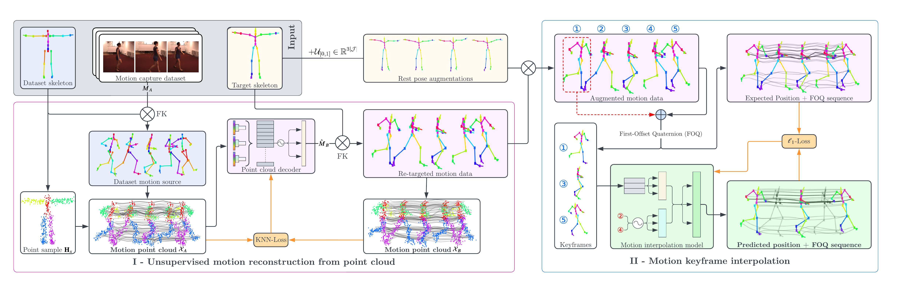

# Point Cloud to Motion Reconstruction Learning
Official implementation of [Motion Keyframe Interpolation for Any Human Skeleton via Temporally Consistent Point Cloud Sampling and Reconstruction](https://arxiv.org/abs/2405.07444) **[ECCV 2024]**

## Training

First, configure [LaFAN1](https://github.com/ubisoft/ubisoft-laforge-animation-dataset) and [Human3.6M](http://vision.imar.ro/human3.6m/description.php) directory locations in `config.json`. In addition, one motion file from CMU MoCap is needed for the `cmu_skeleton` setting. Please use the [BVH version](https://sites.google.com/a/cgspeed.com/cgspeed/motion-capture?authuser=0) for this implementation

PC-MRL is trained in two stages. Run `train_pointcloud.py` first, and then run `train_inpainter.py` afterwards. Ensure that the point cloud processing model checkpoint from `train_pointcloud.py` is properly referenced in `config.json`.

## Evaluation

An example evaluation script is provided in `eval_inpainter.py`. Ensure the CMU MoCap motion data path is correctly set in `config.json`.